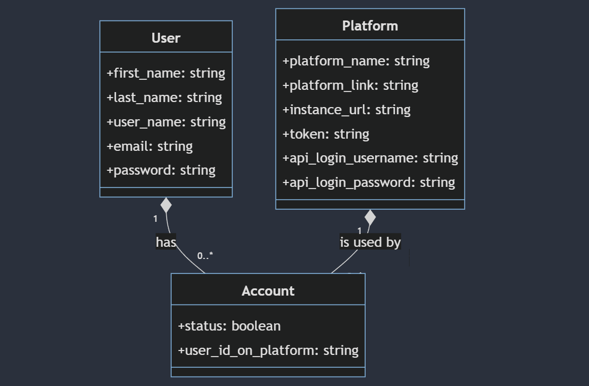

# Employees Accounts Manager 

## Description 
this app is a Django application designed to streamline user account management across various platforms through API requests. With this app,
users can efficiently create and delete accounts on different platforms without having to navigate each platform's individual interface.

## Table of Contents
- [Description](#Description)
- [Getting Started](#getting-started)
    - [Prerequisites](#prerequisites)
    - [Installation](#installation)
- [Usage](#usage)


## Getting Started 

### Prerequisites 
- python 3.10.x and above
- [mc](https://min.io/docs/minio/linux/reference/minio-mc.html#install-mc) and [minio](https://min.io/docs/minio/linux/index.html#quickstart-for-linux?ref=gh) command line interfaces.
    
- API keys or credentials for the platforms

### Installation 
1. **Clone the Repository:**

   ```sh
   git clone https://github.com/your-username/PlatformAccountManager.git
   cd PlatformAccountManager
   

2. **set up venv**

3. **install requirements**
    ```sh
    pip install -r requirements.txt

4. **configure database**
    Open the **settings.py** file in the password_manager Django project folder.
    ```python
        DATABASES = {
        'default': {
            'ENGINE': 'django.db.backends.sqlite3',  # Change to your desired database engine
            'NAME': os.path.join(BASE_DIR, 'db.sqlite3'),
            # ... other settings
        }
    }
    ```
    Replace 'ENGINE' and 'NAME' with your preferred database engine and settings.

5. **Run Migrations:**
    ```sh
        python manage.py migrate

6. **run server:**
    ```sh
        python manage.py runserver

## Usage 
### Models


