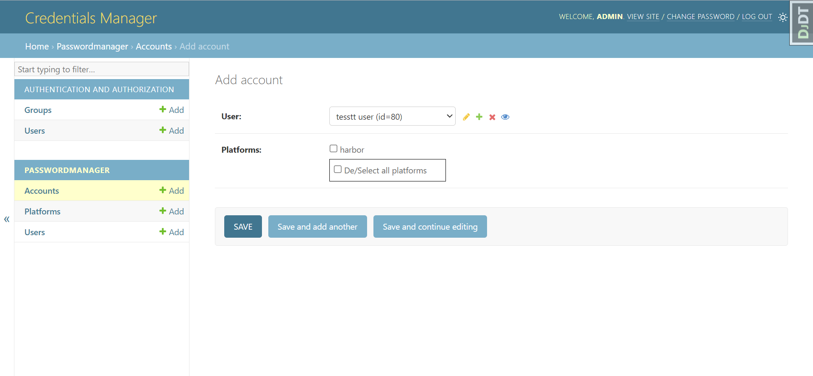

# **Employees Accounts Manager** 

## Description

this app is a Django application designed to streamline user account management across various platforms through API requests. With this app,
users can efficiently create and delete accounts on different platforms without having to navigate each platform's individual interface.

## Table of Contents

- [Description](#description)
- [Getting Started](#getting-started)
  - [Prerequisites](#prerequisites)
  - [Installation](#installation)
- [Project Structure](#project-structure)
  - [Models](#models)
  - [Views and Templates](#views-and-templates)
  - [API REFERENCES (Loggers)](#api-references-loggers)
- [Usage](#usage)
- [Functionalies to be added](#functionalies-to-be-added)

---

## Getting Started

### Prerequisites

- python 3.10.x and above
- [django](https://docs.djangoproject.com/en/4.2/topics/install/)
- [mc](https://min.io/docs/minio/linux/reference/minio-mc.html#install-mc) and [minio](https://min.io/docs/minio/linux/index.html#quickstart-for-linux?ref=gh) command line interfaces.
- API keys or credentials for the platforms

### Installation

1. **Clone the Repository:**

   ```sh
   git clone http://gitlab.sys.infodat.com/oumaima.ouyassine/accounts-manager.git
   cd password_manager

2. **set up venv**

3. **install requirements**

    ```sh
    pip install -r requirements.txt
    ```
    > note: linux users must install **psycopg2-binary** instead of **psycopg2**

4. **configure database**

    Open the **settings.py** file in the password_manager Django project folder.
    ```python
        DATABASES = {
        'default': {
            'ENGINE': 'django.db.backends.sqlite3',  # Change to your desired database engine
            'NAME': os.path.join(BASE_DIR, 'db.sqlite3'),
            # ... other settings
        }
    }
    ```

    Replace 'ENGINE' and 'NAME' with your preferred database engine and settings.

5. **create an admin account**

    ```sh
        python manage.py createsuperuser

6. **Run Migrations:**

    ```sh
        python manage.py migrate

7. **fetch existing accounts:**

    run the following command to fetch existing accounts and add them to your database

    ```sh
        python manage.py fetch_accounts_script
    ```

    > note: consider running the server first, then input the platforms and the api informations (make sure the platforms match the ones already implemented in loggers.py and Account model in models.py) and then running the fetch command

8. **run server:**
    ```sh
        python manage.py runserver

---

## **Project Structure**

### Models

These are the models that construct the database.


### Views and Templates

1. templates :
    in the folder /templates/admin/account :
    - add_form.html : template for the account add page.
    - change_list.html : template for accounts list display.

    and in /templates/admin :
    - add_form_u_p.html: template for both platform and user add pages.

2. views :
    we have two views:
    - fetch_platform_with_existing_accounts :this view is the one rendering the add form for accounts, it gets the platforms on which the selected user has an account and sends it back to the tempalate where they are subtracted from the platform options with which you can create new accounts.

- change_status : this view is called in the accounts list display page, and in charge of changing the account status when the status toggle is triggers.

### **API REFERENCES (Loggers)**

In the loggers.py file you will find four loggers, one for each platfrom:

- **GitlabLogger**
        this logger was built using the [python-gitlab](https://python-gitlab.readthedocs.io/en/stable/index.html) package 
- **MattermostLogger**
        this logger was build using the python requests package to send requests directly to the [mattermost api](https://api.mattermost.com/#tag/introduction)
- **MinioLogger**
        this logger was build using [bmc](https://big-mama-tech.gitlab.io/bmc/) package 
- **HarborLogger**
        this logger was build using the python requests package to send requests  to the [habror api](https://github.com/goharbor/harbor/blob/main/api/v2.0/swagger.yaml)

A logger is a class that contains methods that enables the admin to manage the users on the correspondant platform.

Each of the Logger inherits a constructor and a make_request method from the parent class Logger, and in each logger you will find :

- *create_user()*
- *block_user()*
- *unblock_user()*
- *get_user_id()*
- *get_users()*

---

## **Usage**

1. go to /admin and login using the superuser created earlier's credentials


2. here we have access to all the models, click on add to add a new instance to the database


3. click on add next to accounts to go to /admin/passwordManager/account/add/
here you select a user or create a new one by clicking the + icon


4. after selecting a user,you get a list of platforms on which this user has no accounts, you select the platforms and click save


5. to change the account status (either activating or deactivating the account), you click the status toggle next to the account which wa want to change.


## Functionalies to be added

- [ ] add the option of deactivating all accounts all at once when deleting a user
